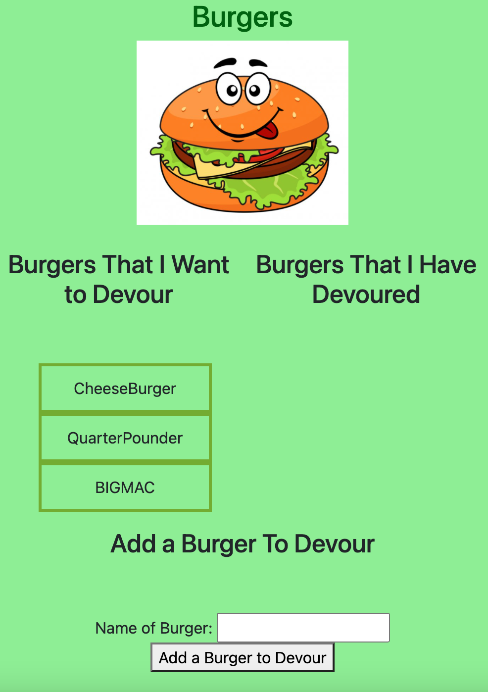

# Burger-Logger

# Table of Contents

-[Description](#description)
-[Installation](#installation)
-[Usage](#usage)
-[Contribution](#contribution)
-[Test](#test)
-[Questions](#questions)

# Description:

* Burger logger is a website that allows you to add burgers you would like to try. 

# Installation:

* Installation of node, express, mysql, heroku database.

# Usage:

* Add burgers you would like to devour. 

# Contribution:

* Commit your update suggestions to GitHub for review and to be merged

# Test:

* None

* Click on the link below to view the live app.
-[Link to the live app]()

* Below is a screen shot of the app.

# Questions:
Click on the link below to go to my GitHub page, for additional questions:
-[GitHub Portfolio](https:github.com/hectordiazjr)

Email me at hectordiaz1103@gmail.com with further questions